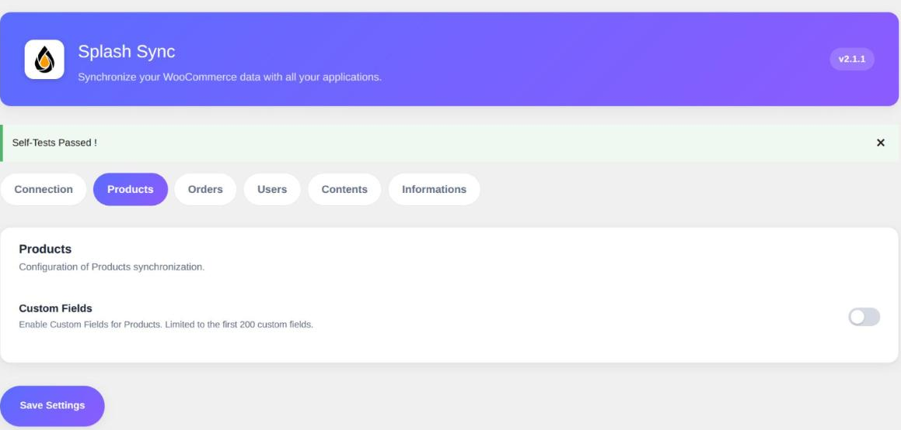

L'onglet **Produits** ne contient qu'une option, mais elle mérite des explications : c'est la
même mécanique que l'on retrouve sur les commandes, les factures, les articles et les pages.

### Champs personnalisés

> Activé par défaut.

WordPress stocke une bonne partie de ses données dans des *post meta* : une valeur libre
attachée à un contenu, identifiée par une clé. Vos extensions en créent en permanence — un
délai de fabrication, un code fournisseur, une mention réglementaire.

Quand cette option est active, Splash expose ces valeurs comme autant de champs
supplémentaires sur vos produits, **en lecture et en écriture**. Elles deviennent alors
mappables depuis votre espace Splash, au même titre que le prix ou le stock.

Trois règles déterminent ce qui apparaît dans la liste :

- Les clés **protégées** sont ignorées. C'est la convention WordPress : toute clé commençant
  par un caractère de soulignement (`_prix_achat`, `_wc_...`) est considérée comme interne et
  n'est jamais exposée.
- Les clés techniques de Splash (`splash_id`, `splash_origin`) sont également écartées.
- La liste est plafonnée aux **200 premières clés** trouvées sur votre site.

> [!NOTE]
> La liste est construite à partir des clés qui existent réellement dans votre base, pas à
> partir d'un produit en particulier. Une clé utilisée par un seul produit apparaîtra donc sur
> tous les autres, simplement vide.

> [!TIP]
> Si un champ attendu n'apparaît pas côté Splash, c'est presque toujours l'une de ces trois
> règles : clé protégée, plafond atteint, ou clé absente de la base parce qu'aucun contenu ne
> la porte encore.

##### Faut-il la laisser active ?

Oui, dans la plupart des cas : c'est ce qui permet de récupérer les données posées par vos
extensions sans développement. Désactivez-la si votre site accumule des centaines de clés
techniques sans intérêt métier — vous allégerez d'autant la description des objets échangée
avec Splash.
