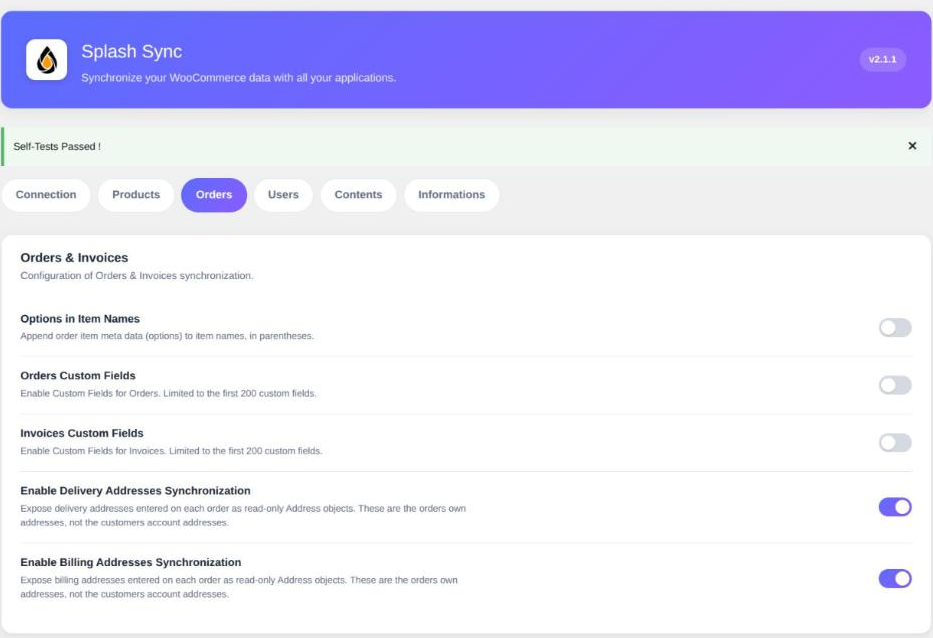

The **Orders** tab gathers the options of orders *and* invoices: in WooCommerce, an invoice is
nothing but an order seen from another angle.



### Options in Item Names

> Enabled by default.

A WooCommerce order line often carries more than the product itself: the chosen variation, an
engraving, a booking date, an option added by an add-ons plugin. Those values live in the line
metadata, and most destination software has no idea what to do with them.

When this option is on, Splash **appends them to the item name, in parentheses**:

```
Organic cotton t-shirt (Size: L, Colour: Navy)
```

Your ERP or your accounting software then receives a complete designation, readable as-is on a
delivery note or an invoice, with no extra mapping.

> [!NOTE]
> The options remain available in a dedicated field too, separate from the name. Turn this
> option off if your destination software knows how to use that field itself, or if you want
> item names strictly identical to your catalogue.

### Orders Custom Fields

> Disabled by default.

Exposes your orders metadata as extra fields, in read and write. The mechanism, its exclusions
and its 200-key cap are described on the **Products** page of this section.

This option is off by default because orders carry a great deal of technical metadata, written
by payment gateways and shipping modules. Only turn it on once you have identified a specific
piece of data to carry over.

### Invoices Custom Fields

> Disabled by default.

Same principle, applied to the Invoice object. Since orders and invoices share the same
WooCommerce record, enabling both exposes the same keys twice: only do it when your Splash
mappings genuinely differ between the two objects.

### Enable Delivery Addresses Synchronization

> Disabled by default.

WooCommerce stores on each order a frozen copy of the delivery address, as it was at the time
of purchase. It never moves afterwards, even if the customer edits their account.

Turn this option on to expose those addresses as **Address objects in their own right**, in
read-only.

> [!IMPORTANT]
> These are the addresses **of the order**, not those of the customer account. That is exactly
> the point: they reflect the real state at the time of the sale, which is what an accounting
> software and a carrier expect.

They are read-only by design: rewriting the address of a past order would mean rewriting
history. Any write attempt is refused and reported in the Splash logs.

### Enable Billing Addresses Synchronization

> Disabled by default.

Exactly the same, applied to the billing side of the order.

> [!TIP]
> Both options increase the number of Address objects visible to Splash: every order brings its
> own. On a high-volume shop, only enable the side you actually need.
