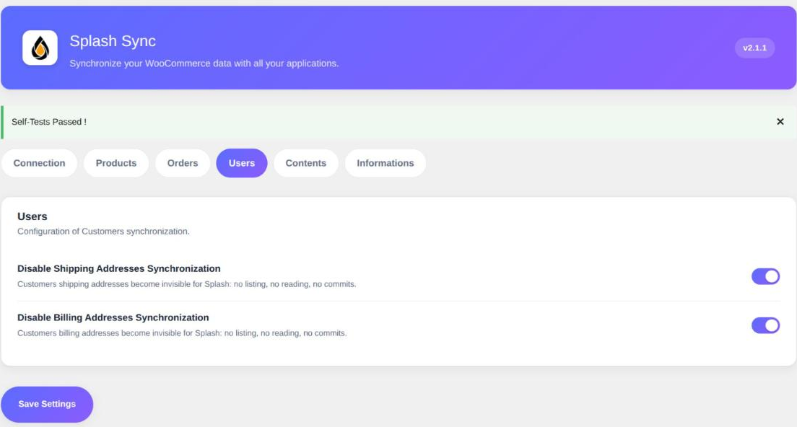

L'onglet **Utilisateurs** ne pilote pas les comptes eux-mêmes — ils sont toujours synchronisés —
mais les **adresses** qui leur sont rattachées.

WooCommerce donne à chaque client deux adresses : une de facturation, une de livraison. Splash
les expose par défaut comme deux objets **Adresse** distincts, en lecture et en écriture, de
sorte qu'un ERP puisse les lire et les corriger.

Les deux options ci-dessous servent à en refermer une, ou les deux.

### Désactiver la synchronisation des adresses de livraison

> Désactivé par défaut : les adresses de livraison sont donc synchronisées.

Cochez cette case pour rendre les adresses de livraison de vos clients **totalement invisibles
pour Splash** : plus de listing, plus de lecture, plus de remontée de modification.

### Désactiver la synchronisation des adresses de facturation

> Désactivé par défaut : les adresses de facturation sont donc synchronisées.

Même chose pour le volet facturation.

> [!WARNING]
> Attention au sens de ces deux options : elles **désactivent**. Case décochée signifie
> synchronisation active, à l'inverse des options de l'onglet Commandes qui, elles, activent.
> Ce choix est volontaire : le comportement par défaut historique du plugin est de tout
> synchroniser, et une mise à jour ne doit jamais couper une synchronisation en place.

### Quand s'en servir

**Votre boutique ne livre pas.** Prestations, contenus numériques, retrait en magasin : les
adresses de livraison sont vides ou fantaisistes. Les couper évite de polluer votre ERP avec
des fiches sans valeur.

**Votre ERP fait autorité sur les adresses.** Si les adresses sont gérées ailleurs et
redescendent vers WooCommerce, vous pouvez préférer que le site ne les expose pas du tout,
plutôt que d'arbitrer le sens de synchronisation champ par champ.

**Volume et RGPD.** Moins d'adresses exposées, ce sont moins de données personnelles qui
circulent, et un objet de moins à lister sur un site à forte volumétrie.

> [!NOTE]
> L'adresse e-mail d'une adresse de livraison est toujours celle du compte client, et reste en
> lecture seule : WooCommerce n'en stocke pas de version propre au volet livraison. Seule
> l'adresse de facturation possède son propre e-mail, modifiable.
