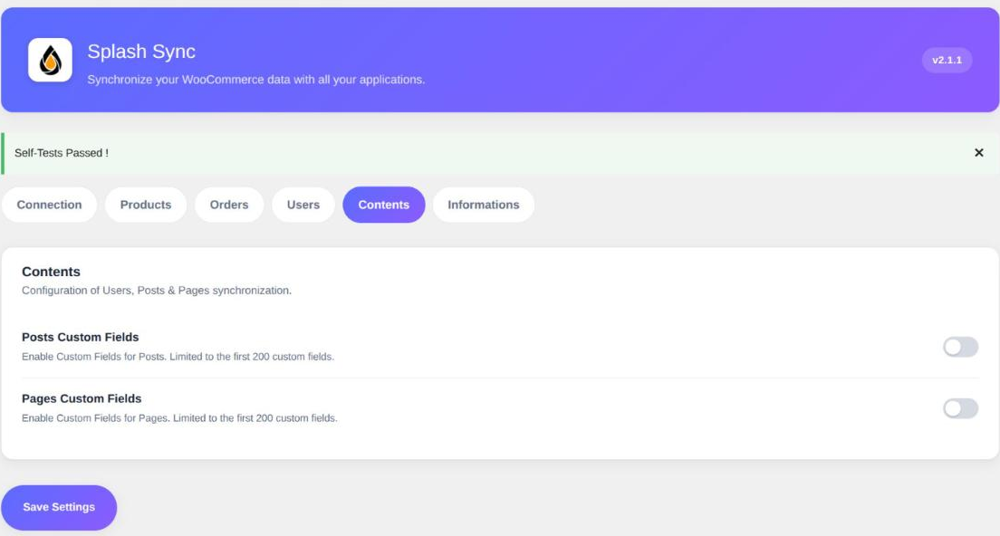

L'onglet **Contenus** concerne la partie éditoriale de votre site : les articles et les pages.
Ils sont synchronisés même sans WooCommerce, et ne demandent aucun réglage pour fonctionner.

Les deux options disponibles ne portent que sur les champs personnalisés.

### Champs personnalisés des articles

> Désactivé par défaut.

Expose les métadonnées de vos articles comme champs supplémentaires, en lecture et en
écriture. Le fonctionnement détaillé — clés protégées écartées, plafond de 200 clés, liste
construite à partir de la base — est décrit sur la page **Produits** de cette section.

Activez-la si vos articles portent des données métier posées par une extension : un auteur
invité, une source, une date d'expiration.

### Champs personnalisés des pages

> Désactivé par défaut.

Même principe, appliqué aux pages.

> [!TIP]
> Les pages construites avec un page builder stockent souvent leur mise en page entière dans
> une métadonnée. Elle peut être volumineuse et illisible : vérifiez ce que vous exposez avant
> de laisser Splash la transporter d'un site à l'autre.
