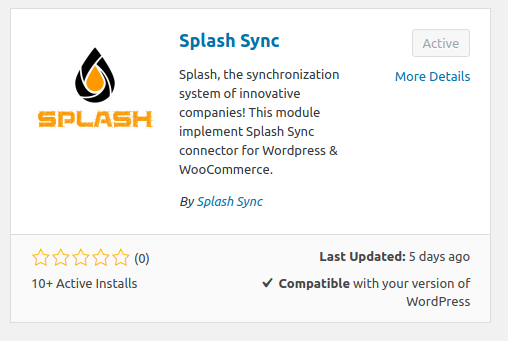

### Configuration minimale

Avant de commencer, vérifiez que votre site remplit les conditions suivantes :

* PHP **7.4** ou supérieur
* WordPress **6.3** ou supérieur, testé jusqu'à WordPress **7.0**
* WooCommerce **8.0** ou supérieur, *optionnel*, pour synchroniser votre boutique
* Un compte Splash Sync actif

### Installation depuis votre tableau de bord

WordPress installe les extensions tout seul, sans jamais toucher à un fichier. Depuis votre
administration, allez dans **Extensions > Ajouter**, cherchez **Splash Connector**, puis
**Installer** et **Activer**.

C'est la méthode recommandée. Si votre hébergeur la bloque, installez le plugin manuellement.

### Installation manuelle

* Téléchargez la dernière version stable sur [splashsync.com](https://www.splashsync.com/fr/modules/)
* Décompressez-la dans votre dossier d'extensions, sous `wp-content/plugins/splash-connector`
* Activez **Splash Connector** depuis l'écran **Extensions**

> [!NOTE]
> Conservez le nom de dossier `splash-connector` : il fait partie de l'adresse du webservice
> que Splash utilise pour joindre votre site.

Une fois le plugin actif, passez à la configuration.
