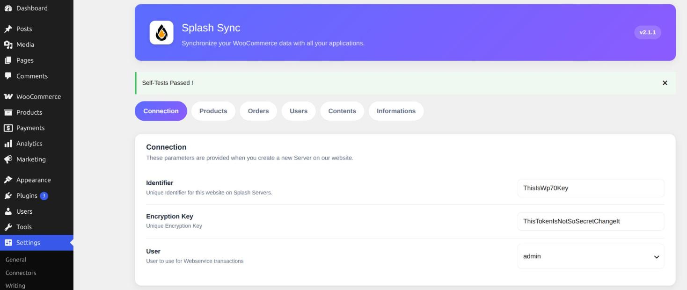
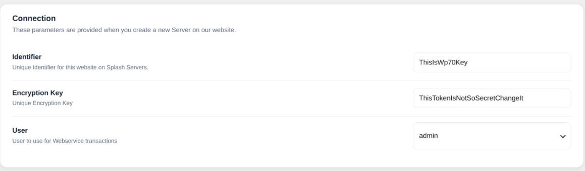
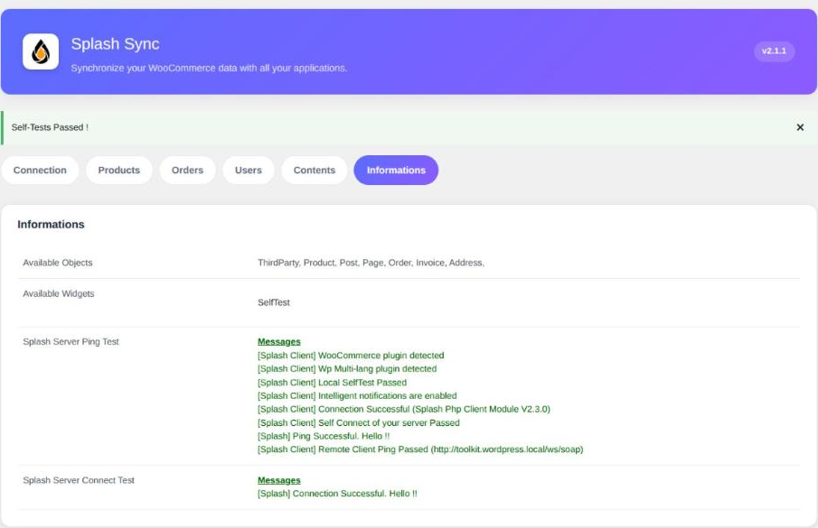

### Ouvrir la configuration

Une fois le plugin actif, sa configuration se trouve dans l'administration WordPress, sous
**Réglages > Splash Sync**.

L'écran est découpé en onglets : **Connexion**, puis un onglet par famille d'objets —
**Produits**, **Commandes**, **Utilisateurs**, **Contenus** — et un onglet **Informations** qui
exécute les self-tests.

### Connectez-vous à votre compte Splash

Votre site a besoin d'une paire de clés pour s'identifier. Créez-les depuis votre espace
Splash : ouvrez **My Servers**, puis cliquez sur **New Server**. Splash vous remet alors un
identifiant et une clé de chiffrement pour ce site.

Reportez les deux dans l'onglet **Connexion**, en prenant garde de n'oublier aucun caractère.

##### Utilisateur

Choisissez le compte sous lequel Splash agira pour toutes les opérations qu'il réalise sur
votre site. Nous recommandons fortement de créer un utilisateur **dédié** à Splash.

> [!IMPORTANT]
> Le plugin respecte les droits WordPress : cet utilisateur doit disposer des permissions
> nécessaires pour lire et écrire les objets que vous souhaitez synchroniser.

### Ajuster les options des objets

Les autres onglets rassemblent les options de chaque famille d'objets. Tout fonctionne par
défaut, n'y revenez donc que si vous avez besoin de :

* **Produits** — exposer les champs personnalisés des produits à Splash.
* **Commandes** — exposer les champs personnalisés des commandes et factures, ajouter les
  options de ligne aux libellés des articles, et synchroniser les adresses de livraison et de
  facturation saisies sur chaque commande sous forme d'objets en lecture seule.
* **Utilisateurs** — désactiver la synchronisation des adresses de livraison ou de facturation des
  clients.
* **Contenus** — exposer les champs personnalisés des articles et des pages.

Chacun d'eux est détaillé, option par option, dans la section **Configuration**.

### Vérifiez les self-tests

À chaque enregistrement, le plugin contrôle vos paramètres et vérifie qu'il dialogue
correctement avec Splash. L'onglet **Informations** liste ce que votre site expose et rejoue
les deux tests.

> [!WARNING]
> Tous les tests doivent passer. Tant que l'un d'eux échoue, aucune synchronisation n'aura lieu.
